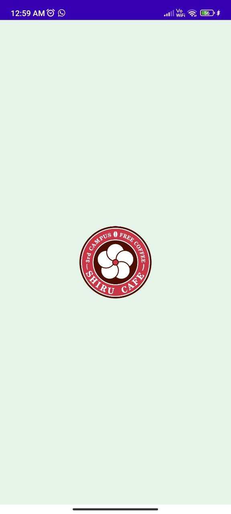
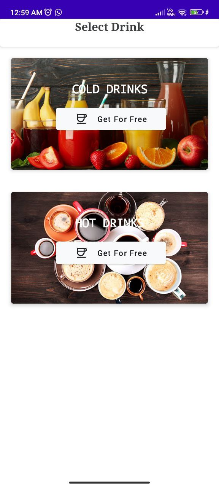
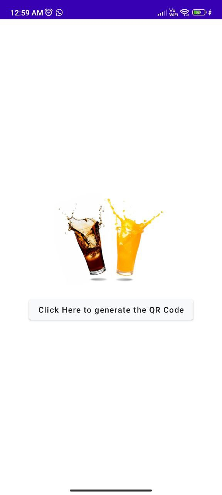
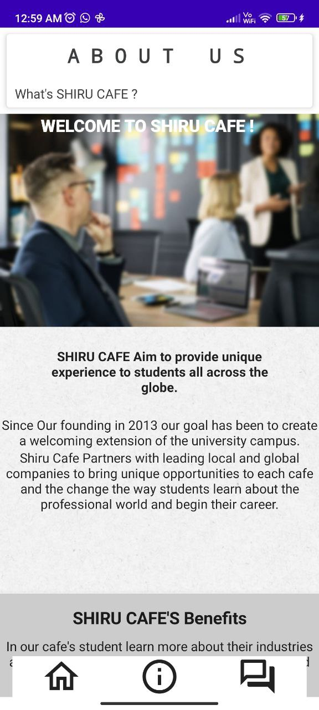
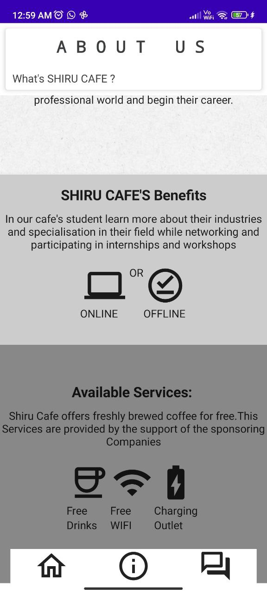

# ShiruCafeClone
-------------------
An App Development project using JetPack Compose

This Shiru Cafe Clone App is clone of an app on Google PLayStore namely Shiru Cafe which allows a few University / College Students to get Cold or Hot Drink for FREE!!!

Concepts USed in the app:
- Different UI layouts in Compose like Making Grid, Scrollable Column.
- Used Navigation Compose to navigate between many windows
- Added Animation to make the app interactive

# App Download Link
--------------------
******

  
   
  
   
  

  
   
  

# Contributers:
-----------------
1. Aman Kumar
2. Aditya LAhane
